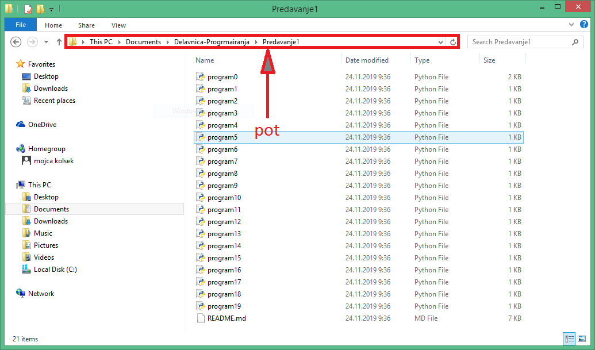
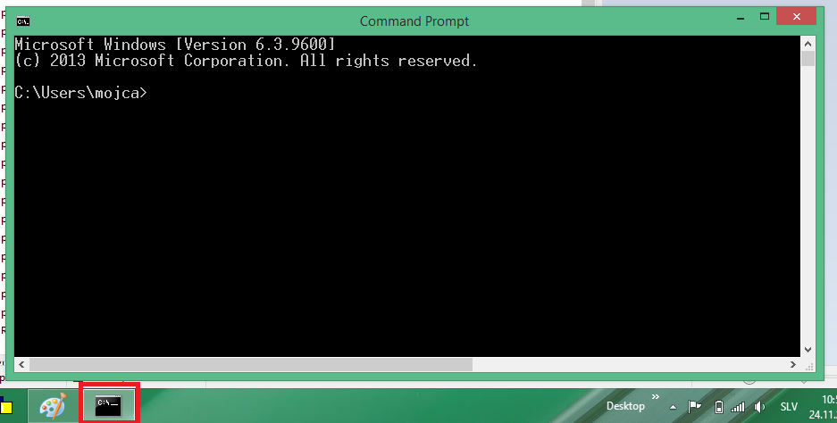
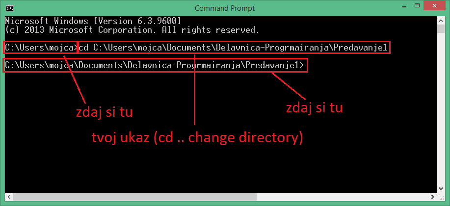
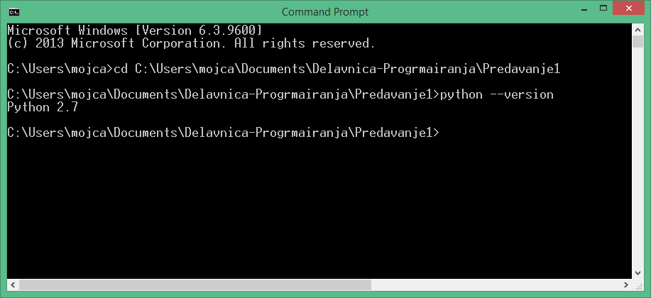
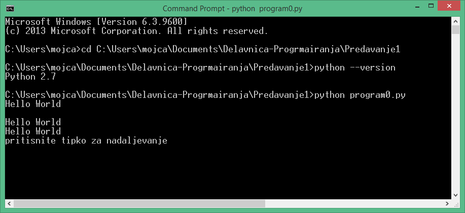

# PREDAVANJE 1

Na teh predavanjih se bomo naučili kaj je program, kaj je stavek in kaj je spremenljivka. Opozorili bomo na pomembne "malenkosti" v zvezi s programom in obliko stavkov.

Predavanje je sestavljeno iz teoretičnega dela, kjer bomo najprej pregledali na kaj moramo biti pozorni. Sledil bo praktični del, kjer bomo najprej pogledali kako stvari delujejo v praksi. Program program0.py je namenjen ilustraciji predstavljenih konceptov. Programi program1.py do program18.py so namenjeni utrjevanju. Vsak izmed teh programov vsebuje eno napako, ki naj jo je potrebno odpraviti, da dobimo pravilno delovanje programa.

## TEORETIČNI DEL

Današnja teorija obsega osnovne koncepte programskih jezikov. Pogledali bomo kaj točno je program, kaj je spremenljivka, kako pišemo stavke, kako spremenljivki priredimo vrednost, kakšnega tipa je vrednost spremenljivke, ter katere so osnovne operacije med spremenljivkami lahko opravljamo.

Pogledali bomo tudi kako kličemo funckije, in sicer na primeru funkcije `print`. Nazadnje bomo pogledali tudi kaj je komentar, saj so komentarji neizredno uporabni in pomembni pri razumevanju programov.

### Program
Program je tekstovna datoteka, poimenovana po vzorcu ime.py, na primer `program.py`. Pri tem pazimo, da je ime občutljivo na razlike v velikih in malih črkah, torej da `program.py` ni enako kot `Program.py` ali `proGram.py`.
Pri poimenovanju programov lahko uporabimo večino zakov, vključno z presledkom, a se pri poimenovanju radi izognemo presledkom. V imenu programa je lahko tudi številka, na primer `program1.py`.

Vsak program vsebuje stavke. Vsak stavek se piše v novo vrstico. Programski jezik python je občutljiv na prazne presledke na začetku stavka, torej pazite, da stavkov ne začenjate s presledki.

Pomemben je tudi vrstni red stavkov. To pomeni, da se lahko izvršna funkcija programa spremeni, v kolikor zamenjamo vrstni red stavkov.

### Spremenljivke in prirejevalni stavek

Vsako spremenljivko lahko poimenujemo poljubno. Pri imenovanju spremenljivk se držimo naslednjih pravil:
* ime spremenljivke lahko vsebuje majhne črke brez šumnikov
* ime spremenljivke lahko vsebuje velike črke brez šumnikov
* ime spremenljivke lahko vsebuje številke
* ime spremenljivke lahko vsebuje znak `_`

Veljavna imena spremenljivk so na primer:
* letorojstva
* letorojstva1
* 1letorojstva
* leto_rojstva
* letoRojstva

Neveljavna imena spremenljivk so na primer:
* leto-rojstva
* šumnik
* leto.rojstva

Pri tem paznimo, da sta spremenljivki `letorojstva` in `letoRojstva` dve različni spremenljivki. 

Progrmaski jezik Python zahteva, da se spremenljivki takoj priredi vrednost. Prireditev vrednosti spremenljivki je eden izmed stavkov programa.
Spremenljivki lahko priredimo različne vrednosti, na primer
``` pi = 3.14 ```

Stavek `pi = 3.14` priredi vrednost `3.14` spremenljivki, poimenovani kot `pi`. Vrednost spremenljivke `pi`po izvršbi tega prirejevalnega stavka je torej `3.14`.

Pazimo na to, da se vrednost spremenljivke lahko prepiše. 

``` 
pi = 3.14 
pi = 0.0
```
Po izvrši teh dveh zaporednih stavkov v rpogramu bo spremenljivka `pi` torej imela vrednost `0`.

### Tip vrednosti spremenljivke

Pri programiranju poznamo več *osnovnih* tipov vrednosti:
* celo število (angleško integer nubmber, skrajšano kot int)
* racionalno število (angleško float)
* niz (angleško string, skrajšano kot str)

Primeri prirejanja različnih tipov:
* r = 2 #*vrednost spremenljivke r je celo število*
* r = 2.0 #*vrednost spremenljivke r je racionalno število*
* ime = "Mojca" #*vrednost spremenljivke ime je niz - bodimo pozorni na narekovaje*

### Osnovne operacije nad spremenljivkami

Vsak programski jezik razume nekatere osnovne operacije. Programski jezik Python na primer pozna naslednje osnovne operacije:
* seštevanje 	`+`
* odštevanje 	`-`
* množenje 		`*`
* deljenje 		`/`

Te operacije lahko izvajamo nad števili:

* seštevanje, odštevanje, množenje, deljenje celih števil (npr. `1 + 2 = 3`)
* seštevanje, odštevanje, množenje, deljenje racionalnih števil (npr. `3.14 + 2.5 = 5.64`)
* seštevanje, odštevanje, množenje, deljenje racionalnih in celih števil (npr. `1 + 3.14 = 4.14`)

Python pozna tudi nekatere osnovne operacije z nizi:

* seštevanje nizov (npr. `"Mojca " + "Kolsek" = "Mojca Kolsek"`)
* množenje nizov in celih števil (npr. `"Mojca " * 2 = "Mojca Mojca "`)

Pri tem pazimo, da `2 * "Mojca "` ni veljaven stavek, saj bi v tem primeru radi množili `2` z `"Mojca "` in ne `"Mojca "` z `2`.

Osnovnih operacij je še več in jih bomo spoznali v sledečih predavanjih.

### Spreminjanje tipa vrednosti
Včasih bi radi spremenili tip vrednosti spremenljivke. Radi bi na primer jemali neko celo število kot niz. V ta namen so ponujene funkcije, ki to opravijo za nas.
Na primer:
```
pi = 3.14
opis = "pi = " + pi
print(opis)
```

Ta program naj bi izpisal `pi = 3.14`, a če tak program zaženemo, nam bo izpisal napako. Python namreč ne ve, kako bi seštel niz z racionalnim številom. Ve namreč le, kako sešteje dva niza. V ta namen bi radi tip vrednosti spremenljivke pi spremenili v niz:

```
opis = "pi = " + str(pi)
print(opis)
```

Python ima naslednje tri osnovne funkcije za spreminjanje tipa:
* str(x) #*tip vrednosti spremenljivke x se spremeni v niz*
* int(x) #*tip vrednosti spremenljivke x se spremeni v celo število* 
* float(x) #*tip vrednosti spremenljivke x se spremeni v racionalno število*

Pozorni bodimo, da lahko funkcija povzroči napako; 
* stavek `ime = int("Mojca")` bo povzročil napako, saj funkcija `str` ne ve, kako naj niz `"Mojca"` spremeni v celo število.
* Stavek `x = int("7")` bo bo spremenljivki `x` priredil vrednost `7.
* Stavek `y = float("7")` bo spremenljivki `y` priredil vrednost `7.0`.
* stavek `str = str(y)`  bo spremenljivki `str` priredil vrednost `"7.0"`.

### Komentar

V naši kodi lahko pišemo komentarje. Prevajalnik bo vrstice s komentarji preprosto preskočil. Kljub temu je dobra praksa pisati komentarje v program, saj to zviša razumljivost kode. Komentar se napiše tako:
```
i = 0
# To je komentar
pi = 3.14
```


Z `#` začnemo eno-vrstični komentar.
V kolikor bi radi zapisali več-vrstični komentar, to lahko zapišemo tako:
```
i = 0
"""
To je komentar
To je še vedno komentar
"""
pi = 3.14
```

# PRAKTIČNI DEL
Na vrhu te spletne strani boste našli več programov:
* [program0.py](./program0.py)
* [program1.py](./program1.py)
* ...
* [program18.py](./program18.py)

Program  `program0.py` deluje kot demonstaracija teoretičnega dela.
Ostali programi so namenjeni utrjevanju snovi. Vsak izmed teh naj bi izpisal enak niz, oblike "ime priimek starost". Vsak program vsebuje napako, ki jo je potrebno odpraviti, da se program pravilno zažene.

Vse datoteke lahko prenesete na svoj računalnik v formatu `.zip`, s klikom na gumb `cone or download`.

Razširite datoteko (unzip). Pojdite v vašo datoteko, in kopirajte `pot` to te datoteke. To storite tako, da kliknete na pot, kot prikazano v spodnji sliki, in kopirate niz. Vaša pot bo podobnja naslednji : `C:\Users\mojca\Documents\Delavnica-Progrmairanja\Predavanje1`


Odprite ukazno okno (angleško "command prompt", skrajšano kot `cmd`. Oprite `start` in iščite za aplikacijo `cmd`.


V ukaznem oknu se morate premakniti v vašo datoteko. To naredite tako, da v vaše ukazno okno vtipkate ukaz `cd C:\Users\mojca\Documents\Delavnica-Progrmairanja\Predavanje1`, kjer je `C:\Users\mojca\Documents\Delavnica-Progrmairanja\Predavanje1` vaša pot, ki ste jo prej kopirali. 


Če v ukazno okno vtipkate ukaz `python --version` , bi vam moralo izpisati verzijo prevajalnika python, naloženo na vašem računalniku.



Program zaženete z ukazom `python`, na primer `python program0.py`.
Ne pozabite vedno shraniti tekstovnega programa, če ste ga spremenili, predn ga zaženete.



